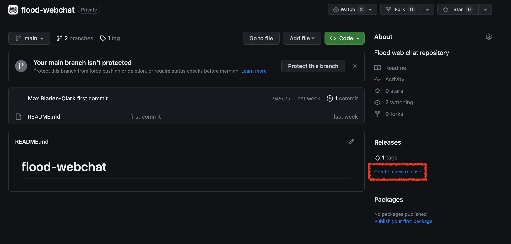
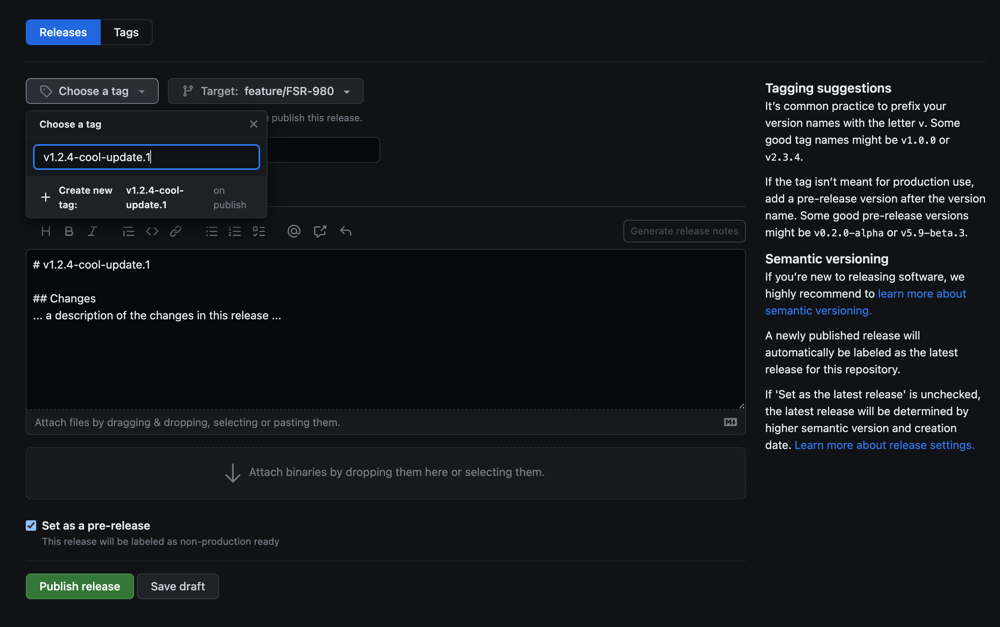
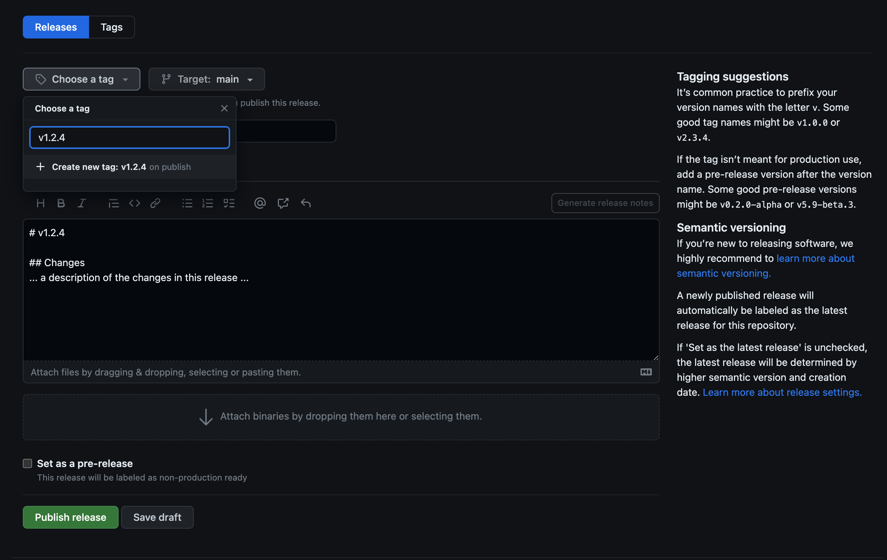

# How to Publish

This repo implements automated publishing via GitHub actions triggered by creating a release in GitHub.
Releases should respect [the semantic versioning specification v2.0.0](https://semver.org/spec/v2.0.0.html).

## A Pre-Release
1) Go to the [GitHub repo homepage](https://github.com/DEFRA/flood-webchat) for this project.  
2) Click "Create a new release"

  

3) Select your Target branch, by default it will be the "main" branch.  
4) Click "Choose a Tag", enter a version tag with the appropriate semantic version bump and suffixed with a pre-release identifier and click "Create new tag". _(for example if the latest published version was `v1.2.3` and you wish to publish a pre-release from your "cool-update"
   branch, name the release: `v1.2.4-cool-update.1`)_

5) Use your version name as a title, and add appropriate release notes in the description field.
6) Tick the "Set as a pre-release" checkbox.
7) Click "Publish release"
8) A GitHub Action should then be triggered automatically, publishing your pre-release to npm.  
9) You can install your pre-release into a consuming project by running `npm i @defra/flood-webchat@<version-number>`, e.g. `npm i @defra/flood-webchat@1.2.4-cool-update.1`.  

_NOTE: pre-release identifiers must match the pattern `^-[0-9A-Za-z-].*$`_

## A Release
1) Go to the [GitHub repo homepage](https://github.com/DEFRA/flood-webchat) for this project.
2) Click "Create a new release"

3) Ensure that your Target branch is the "main" branch (this is the default).
4) Click "Choose a Tag", enter a version tag with the appropriate semantic version bump.

5) Use your version name as a title, and add appropriate release notes in the description field.
6) Ensure that the "Set as a pre-release" checkbox is **NOT** checked.
7) Click "Publish release"
8) A GitHub Action should then be triggered automatically, publishing your release to npm.
9) You can install your release into a consuming project by running `npm i @defra/flood-webchat@<version-number>`, e.g. `npm i @defra/flood-webchat@1.2.4`.
